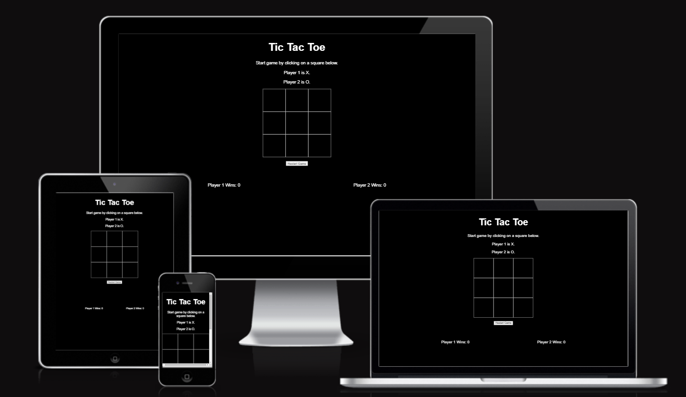

# Tic Tac Toe 

For this project i decided toc create a simple Tic Tac Toe game. I have designed a simple two-player game that is simply operated by clicking on your desired box. I hope this site can show how Javascript along with relatively simple HTML and CSS can be used to create fun to play games that everyone can enjoy.

## Features
### Heading

A simple heading making it clear what the game is immedietly when they arrive.

### Game Area

The game area is a simple 3x3 box area that the user clickes on when it is their go. Above they will find info about which player is which and how to start the game. They will also find a reset button at the bottom that can be used to reset the game at any point.

### Game Results 

At the bottom of the page, they will find an area that will tell the user how many times each player has won and who won the last game

## Testing
### Validator Testing 
- HTML
    - No errors were returned when passing through the official [W3C validator](https://validator.w3.org/nu/?showsource=yes&doc=https%3A%2F%2Fsean127.github.io%2FTic_Tac_Toe%2F)
- CSS
    - No errors were found when passing through the official [(Jigsaw) validator](https://jigsaw.w3.org/css-validator/validator)
- JavaScript
    - No errors were found when passing through the official [Jshint validator](https://jshint.com/)
        - The following metrics were returned: 
        - There are 7 functions in this file.

        - Function with the largest signature take 2 arguments, while the median is 1.

        - Largest function has 27 statements in it, while the median is 2.

        - The most complex function has a cyclomatic complexity value of 10 while the median is 1

## Deployment:

The site was deployed to GitHub as follows:
- Navigating to setting
- Selecting Master Branch from the source menu
- Obtaining the link to the website

## Credits

- The code for the game-box was adapted from [CodeBrainer](https://www.codebrainer.com/blog/tic-tac-toe-javascript-game)
- The Javacsript code from the game came from [CodeLeaks](https://www.codeleaks.io/tic-tac-toe-game-using-html-css-and-javascript/)